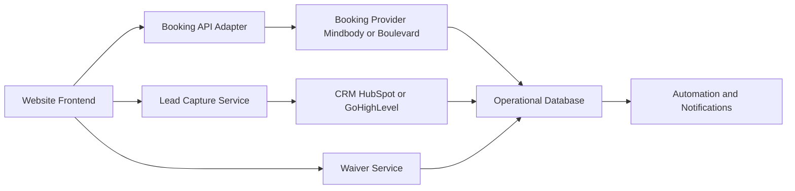

# System Design

## Architecture Overview

Frontend (React, Next.js, or Webflow) sends user actions to a booking integration layer, which syncs contact and conversion data to CRM and persists operational records in your application database.

## Flow Diagram

## Core Components

1. Frontend Layer
- Landing pages, service pages, pricing pages, FAQ content.
- CTA events, lead forms, and booking intents.

2. Booking API Adapter
- Normalizes provider-specific APIs into a single internal contract.
- Handles slot lookup, reservation creation, and booking state updates.

3. CRM Integration Service
- Pushes new leads and lifecycle events.
- Triggers onboarding sequences (welcome email, first-session reminders, upsell offers).

4. Waiver Service
- Captures signed waiver artifacts before booking finalization.
- Stores signature metadata, timestamp, and document version for compliance.

5. Operational Database
- Stores clients, leads, waivers, bookings, memberships, and event logs.

## Key Business Logic

1. First Freeze Special funnel
- Trigger when visitor clicks promotional CTA.
- Create lead record in CRM.
- Start automated welcome sequence.

2. Waiver gating
- Booking status remains `pending_waiver` until approved waiver exists.
- Confirmation only moves to `confirmed` after waiver check passes.

3. Safety and contraindication workflow
- Optional health-intake questionnaire prior to first booking.
- Escalate flagged responses for manual review.

## Security and Compliance Baseline

1. Transport and edge
- Enforce TLS 1.2+ for all endpoints.
- Use HSTS and secure cookie defaults.

2. Data security
- Encrypt data at rest for personal and health-related fields.
- Apply strict role-based access control for staff dashboards.

3. Auditability
- Log waiver completion events and booking state transitions.
- Keep immutable event history for dispute resolution.

4. Regulatory posture
- If handling protected health information, complete a HIPAA readiness review.
- Use signed Business Associate Agreements with relevant vendors where required.

## Suggested Event Contracts

- `lead.created`
- `booking.intent_created`
- `waiver.signed`
- `booking.confirmed`
- `booking.cancelled`
- `membership.started`
- `membership.renewed`
